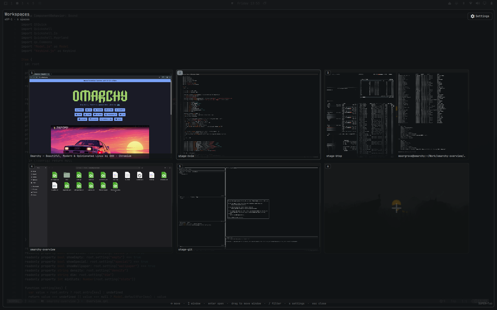
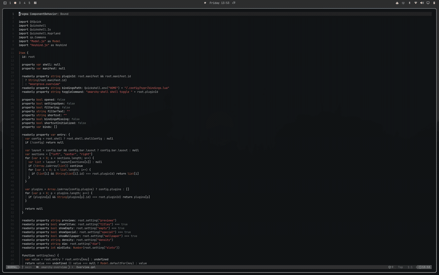

# Overview

A workspace overview for [Omarchy](https://omarchy.org). Every space on one screen,
with live window previews, drag-and-drop, and a bar icon that opens it in one click.





## Features

- **Live previews** — real, moving window content, including workspaces you are not on
- **True layout** — windows sit exactly where Hyprland has them, tiled and floating
- **Drag to move** — pull a window onto another space to send it there
- **One click** — the bar icon toggles the overview; right-click opens settings
- **Your keybinding, your call** — ships unbound; pick a combination in settings and nothing touches your Hyprland config until you apply it
- **Keyboard first** — arrows to navigate, `/` to filter, enter to jump, esc to leave
- **Every monitor** — each screen shows its own spaces, at its own aspect ratio

## Install

```bash
omarchy plugin add https://github.com/itsmoorgrove/omarchy-overview.git
omarchy plugin enable moorgrove.overview
```

The icon appears in the left section of the bar. The plugin ships with **no keyboard
shortcut** and writes nothing to your Hyprland configuration on install — open the
overview from the bar icon, then set a shortcut in settings if you want one. Move the
icon with `omarchy bar move moorgrove.overview --section right`.

## Use

| Action | Result |
|---|---|
| Your shortcut, once set | Toggle the overview |
| Click the bar icon | Toggle the overview |
| Right-click the bar icon | Open settings |
| Click a space | Switch to it |
| Click a window | Focus it |
| Middle-click a window | Close it |
| Drag a window onto a space | Move it there, silently |
| `←` `→` `↑` `↓` / `h` `j` `k` `l` | Move around the grid of spaces |
| `tab` / `shift+tab` | Move between windows in the selected space |
| `1`–`0` | Jump to a space |
| `enter` | Open the selection |
| `/` | Filter windows by title or app |
| `s` | Settings |
| `esc` | Clear the filter, then close |

## Settings

Open the gear in the top right, or press `s`. Everything is a click.

Shortcut · window previews · window titles · wallpaper backdrop · empty spaces ·
special spaces · card size · backdrop dim · minimum spaces

No shortcut is set until you set one. Pressing **Apply** in the settings sheet is the
only thing that writes to `~/.config/hypr/bindings.lua`; it puts a single managed block
there and rewrites that block whenever you change the combination. Applying unbinds
whatever held that combination before, and the settings sheet names it first so you can
decide. **Clear** removes the block, leaves the rest of the file untouched, and stays
cleared. Everything else is stored inline on the plugin's entry in
`~/.config/omarchy/shell.json`.

### How the bindings file is accessed

`~/.config/hypr/bindings.lua` is a predictable path that Hyprland sources and executes,
so the plugin never touches it from QML directly. Everything goes through the small
helpers in `bin/`:

| Helper | Does |
|---|---|
| `omarchy-overview-bindings-read` | One `open()` with `O_NOFOLLOW\|O_NONBLOCK`, then `fstat`/`read` on that same descriptor — regular file, owned by you, under a 512 KiB cap |
| `omarchy-overview-bindings-write` | Builds the replacement in a fresh `O_EXCL` sibling and `rename()`s it into place relative to a held directory descriptor; the target is never opened for writing |
| `omarchy-overview-binds` | Runs `hyprctl -j binds` under a timeout, reads its stdout incrementally against a hard 1 MiB ceiling — signalling the child the moment it crosses either bound — and re-emits only the five fields the conflict check uses |

A symlink, FIFO, device node, or oversized file at the bindings path is refused with a
message in the settings sheet rather than followed, blocked on, or read into the
persistent shell.

## Requirements

Omarchy 4 (Quattro) with `omarchy-shell`, Hyprland 0.56 or newer.

## License

MIT
