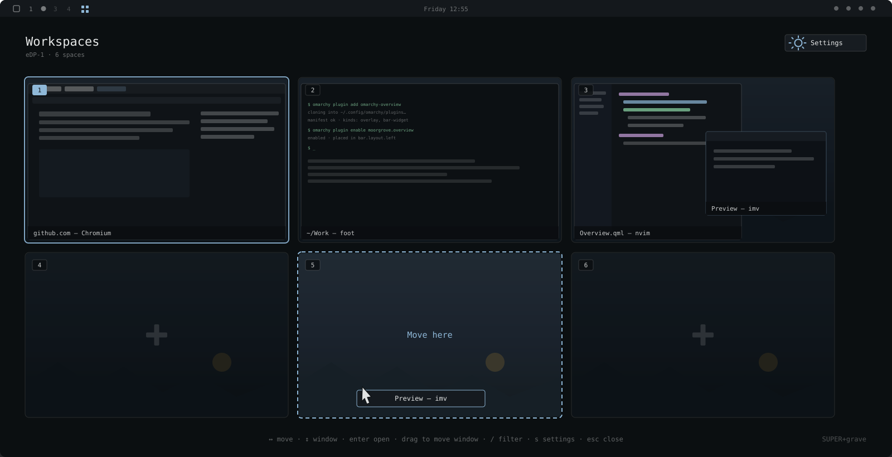

# Overview

A workspace overview for [Omarchy](https://omarchy.org). Every space on one screen,
with live window previews, drag-and-drop, and a bar icon that opens it in one click.



## Features

- **Live previews** — real, moving window content, including workspaces you are not on
- **True layout** — windows sit exactly where Hyprland has them, tiled and floating
- **Drag to move** — pull a window onto another space to send it there
- **One click** — the bar icon toggles the overview; right-click opens settings
- **Bound on install** — `SUPER + Tab` out of the box, changeable by click in the settings sheet
- **Keyboard first** — arrows to navigate, `/` to filter, enter to jump, esc to leave
- **Every monitor** — each screen shows its own spaces, at its own aspect ratio

## Install

```bash
omarchy plugin add https://github.com/moorgrove/omarchy-overview.git
omarchy plugin enable moorgrove.overview
```

The icon appears in the left section of the bar, and `SUPER + Tab` is bound on first
run. That combination is Omarchy's *Next workspace* by default, so enabling the plugin
takes it over — pick a different one in settings if you want it back. Move the icon with
`omarchy bar move moorgrove.overview --section right`.

## Use

| Action | Result |
|---|---|
| `SUPER + Tab` | Toggle the overview |
| Click the bar icon | Toggle the overview |
| Right-click the bar icon | Open settings |
| Click a space | Switch to it |
| Click a window | Focus it |
| Middle-click a window | Close it |
| Drag a window onto a space | Move it there, silently |
| `←` `→` / `h` `l` | Move between spaces |
| `↑` `↓` / `k` `j` | Move between windows |
| `1`–`0` | Jump to a space |
| `enter` | Open the selection |
| `/` | Filter windows by title or app |
| `s` | Settings |
| `esc` | Clear the filter, then close |

## Settings

Open the gear in the top right, or press `s`. Everything is a click.

Shortcut · window previews · window titles · wallpaper backdrop · empty spaces ·
special spaces · card size · backdrop dim · minimum spaces

The shortcut is a single managed block in `~/.config/hypr/bindings.lua`, written on
first run and rewritten whenever you change it. It unbinds whatever held that
combination before, and the settings sheet tells you what that was. Clearing it removes
the block, leaves the rest of the file untouched, and stays cleared. Everything else is
stored inline on the plugin's entry in `~/.config/omarchy/shell.json`.

## Requirements

Omarchy 4 (Quattro) with `omarchy-shell`, Hyprland 0.56 or newer.

## License

MIT
